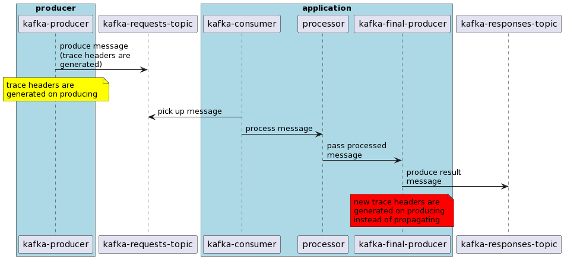

### Problem statement
When an application with otel auto-instrumentation publishes a message to a Kafka topic it generates a trace (b3multi or tracecontex or both, doesn't matter). Let's call `Trace A`.
Then another application with otel auto-instrumentation picks up the message (there are present Kafka headers for the trace) processes it and puts it to another Kafka topic (or the same doesn't matter).

`Expected result`: `Trace A` generated initially is preserved in the last message. Context propagation is place.

`Actual result`: `Trace A` isn't preserved, another trace is generated and put to header of the last kafka message in the chain.

**Statement** Each publish to Kafka by java application with auto-instrumentation doesn't propagate trace, but generates new one.

_Notes_: Used otel javaagent is of version `1.10.1`. I'm interested in `b3multi` propagation in particular, but found that others, like `tracecontex` doesn't happen as well.


### Piece of Architecture




## Prerequisite
* `java 17`
* `docker` and `docker-compose`
* Run environment of your choice
  * `Intellij IDEA`
  * `Maven`

### How to run the application

##### Start all the back components
```shell
docker-compose up
```

##### Start consumer of inbound (requests) topic
This is useful for seeing visually values (headers) send. Execute from project's root.  
```shell
./bin/kafka/bin/kafka-console-consumer.sh --bootstrap-server localhost:29092 \
  --property print.key=true --property print.headers=true --property print.timestamp=true \
  --topic file-management-requests-01-test_tenant_sftp
```

##### Start consumer of outbound (responses) topic
This is useful for seeing visually values (headers) send. Execute from project's root.
```shell
./bin/kafka/bin/kafka-console-consumer.sh --bootstrap-server localhost:29092 \
  --property print.key=true --property print.headers=true --property print.timestamp=true \
  --topic file-management-requests-01-test_tenant_sftp
```

##### Start the `application`

* Using Intellij IDEA you can pick up the [run file automatically](.run/application.run.xml) with all the predefined configuration
* Or hardcore
  * build the jar via `mvn clean install`
  * ```shell
      <your-java-17-path> -Dotel.traces.exporter=otlp -Dotel.propagators=b3multi,tracecontext -Dotel.otlp.use.tls=false -Dotel.exporter.otlp.endpoint=http://localhost:4317 -Dotel.resource.attributes=service.name=kop-application -javaagent:./bin/otel/opentelemetry-javaagent-all-1.10.1.jar -jar ./application/target/application-1.0.0-SNAPSHOT.jar
    ```


##### Start the `producer`
* Using Intellij IDEA you can pick up the [run file automatically](.run/producer.run.xml) with all the predefined configuration
* Or hardcore
  * build the jar via `mvn clean install`
  * ```shell
        <your-java-17-path> -Dotel.traces.exporter=otlp -Dotel.propagators=b3multi,tracecontext -Dotel.otlp.use.tls=false -Dotel.exporter.otlp.endpoint=http://localhost:4317 -Dotel.resource.attributes=service.name=kop-producer -javaagent:./bin/otel/opentelemetry-javaagent-all-1.10.1.jar -jar ./producer/target/producer-1.0.0-SNAPSHOT.jar
      ```